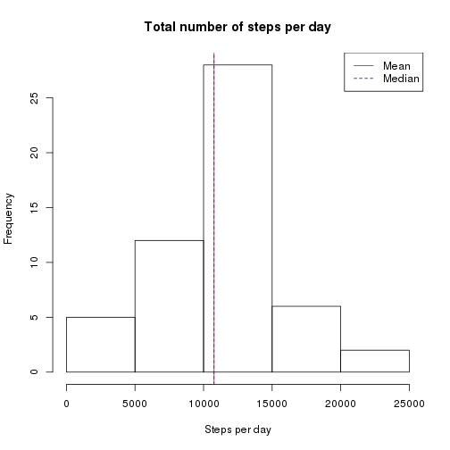
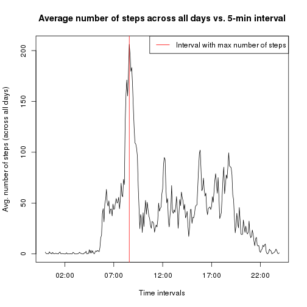
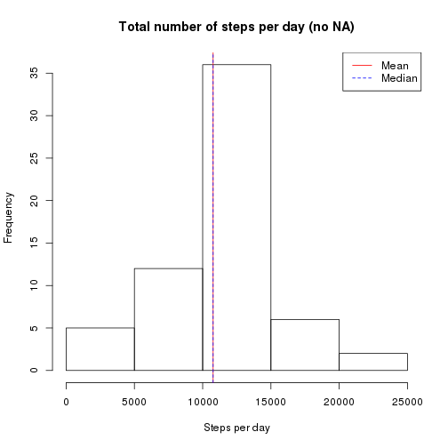

# Reproducible Research: Peer Assessment 1  

**P. Paquay**

This is my report written in R markdown for the *Peer Assessment 1* for the "Reproducible Research" course on Coursera. 

## Loading and preprocessing the data

As English isn't my first language I need to set my locales to this language.


```r
Sys.setlocale(locale = "en_GB.UTF-8")
```

```
## [1] "LC_CTYPE=en_GB.UTF-8;LC_NUMERIC=C;LC_TIME=en_GB.UTF-8;LC_COLLATE=en_GB.UTF-8;LC_MONETARY=en_GB.UTF-8;LC_MESSAGES=fr_BE.UTF-8;LC_PAPER=fr_BE.UTF-8;LC_NAME=C;LC_ADDRESS=C;LC_TELEPHONE=C;LC_MEASUREMENT=fr_BE.UTF-8;LC_IDENTIFICATION=C"
```


Below is the code I used to load an preprocess the data. The loading step simply consists in reading the data with the *read.csv()* function and storing the result in the "activity" data frame. The preprocessing step consists in creating a new column in the data frame with the timestamp (date & time in POSIXct format). To do this I first need to change the interval format to HH:MM.


```r
activity <- read.csv("activity.csv", header = TRUE)
activity$interval <- ifelse(nchar(activity$interval) == 1, paste0("000", activity$interval), 
    activity$interval)
activity$interval <- ifelse(nchar(activity$interval) == 2, paste0("00", activity$interval), 
    activity$interval)
activity$interval <- ifelse(nchar(activity$interval) == 3, paste0("0", activity$interval), 
    activity$interval)
activity$timestamp <- as.POSIXct(paste(as.character(activity$date), activity$interval), 
    format = "%Y-%m-%d %H%M")
```


## What is mean total number of steps taken per day ?

To answer this question I begin with creating a new data frame "sum.steps.day" which contains the total number of steps per day from the "activity" data frame with the *aggregate()* function.


```r
sum.steps.day <- aggregate(activity$steps, list(Date = format(activity$timestamp, 
    "%Y-%m-%d")), sum)
colnames(sum.steps.day)[2] <- "StepsPerDay"
```


To make a histogram of the total number of steps I simply use the *hist()* function from the Base package.


```r
hist(sum.steps.day$StepsPerDay, main = "Total number of steps per day", xlab = "Steps per day")
```

 


To compute the mean and median I use the *mean()* and *median()* function.


```r
options(scipen = 999)
mean(sum.steps.day$StepsPerDay, na.rm = TRUE)
```

```
## [1] 10766
```

```r
median(sum.steps.day$StepsPerDay, na.rm = TRUE)
```

```
## [1] 10765
```


To conclude the mean total number of steps per day is 10766.1887 and the median total number of steps per day is 10765.

## What is the average daily activity pattern ?

To answer this question I proceed in the same way as before, I create a new data frame named "avg.steps.interval" which contains the average number of steps across all days from "activity" with the *aggregate()* function.


```r
avg.steps.interval <- aggregate(activity$steps, list(Interval = format(activity$timestamp, 
    "%H:%M:%S")), mean, na.rm = TRUE)
colnames(avg.steps.interval)[2] <- "AvgSteps"
```


To plot the time series of the 5-minute intervals and the average number of steps taken averaged across all days I use the *plot()* function of the Base package. Using POSIXct type allows a plot with the  x-axis correctly labelled with the hours of the day.


```r
plot(as.POSIXct(avg.steps.interval$Interval, format = "%H:%M:%S"), avg.steps.interval$AvgSteps, 
    type = "l", main = "Average number of steps across all days vs. 5-min interval", 
    xlab = "Time intervals", ylab = "Avg. number of steps (across all days)")
```

 


To find the 5-minute interval containing the maximum number of steps on average across all days I use the *which.max()* function.


```r
avg.steps.interval[which.max(avg.steps.interval$AvgSteps), 1]
```

```
## [1] "08:35:00"
```


So, the 5-minute interval containing the maximum number of steps on average across all days is [08:35:00, 08:40:00[.

## Imputing missing values

To compute the total number of missing values in the dataset I use the *is.na()* function.


```r
sum(is.na(activity$steps))
```

```
## [1] 2304
```


The total number of missing values is 2304. My strategy of choice to fill in the missing values in the dataset is to use the mean value for that 5-minute interval across all days. To do this I begin by replacing all NA values by 0, I then create a "steps.mask" vector with the 288 average number of steps across all days repeated 61 times and with 0 values where the corresponding non NA values of the dataset are. It remains to add the altered dataset and the mask to obtain the filled in data frame "activity.no.na".


```r
activity.no.na <- activity
activity.no.na$steps[is.na(activity$steps)] <- 0
steps.mask <- rep(avg.steps.interval$AvgSteps, 61)
steps.mask[!is.na(activity$steps)] <- 0
activity.no.na$steps <- activity.no.na$steps + steps.mask
```


I use the same technique as before to make a histogram of the total number of steps taken each day.


```r
sum.steps.day.no.na <- aggregate(activity.no.na$steps, list(Date = format(activity.no.na$timestamp, 
    "%Y-%m-%d")), sum)
colnames(sum.steps.day.no.na)[2] <- "StepsPerDay"
hist(sum.steps.day.no.na$StepsPerDay, main = "Total number of steps per day (no NA)", 
    xlab = "Steps per day")
```

 


As before, to compute the mean and median I use the *mean()* and *median()* function.


```r
mean(sum.steps.day.no.na$StepsPerDay)
```

```
## [1] 10766
```

```r
median(sum.steps.day.no.na$StepsPerDay)
```

```
## [1] 10766
```


To conclude the mean total number of steps per day with the filled in data frame is 10766.1887 and the median total number of steps per day is 10766.1887.  

We see that the mean total number of steps per day with the "activity.no.na" data frame is unchanged compared to the mean total number of steps per day with the "activity" data frame, this is completely understandable as we used the mean total number of steps to fill in the NA values. However, the median total number of steps per day with the "activity.no.na" data frame is greater compared to the median total number of steps per day with the "activity" data frame, this is due to the fact that we add more non NA values to the second half of  the data set than to the first half.

## Are there differences in activity patterns between weekdays and weekends ?

First I create a new column in the "activity.no.na" data frame which is a factor variable with two levels (named "weekday" and "weekend").


```r
activity.no.na$daytype <- factor(weekdays(activity.no.na$timestamp) == "Sunday" | 
    weekdays(activity.no.na$timestamp) == "Saturday")
levels(activity.no.na$daytype) <- c("weekday", "weekend")
```


I then proceed to create a new data frame "avg.steps.interval.no.na" which contains the average number of steps across all days conditioned by the factor variable "daytype".


```r
avg.steps.interval.no.na <- aggregate(activity.no.na$steps, list(Interval = format(activity.no.na$timestamp, 
    "%H:%M:%S"), Daytype = activity.no.na$daytype), mean)
colnames(avg.steps.interval.no.na)[3] <- "AvgSteps"
```


Before creating the panel plot, I load the "lattice" library, I then use the *xyplot()* function to plot the time series of the 5-minute intervals and the average number of steps taken averaged across all weekdays or weekend days.


```r
library(lattice)
xyplot(AvgSteps ~ as.POSIXct(Interval, format = "%H:%M:%S") | Daytype, data = avg.steps.interval.no.na, 
    type = "l", layout = c(1, 2), main = "Average number of steps across all days (weekday or weekend) \n vs. 5-min interval", 
    xlab = "Time intervals", ylab = "Avg. number of steps (across all days)", 
    scales = list(x = list(format = "%H:%M:%S")))
```

 


To summarize the differences in the activity patterns between weekdays and weekend days, I create a summary of the average number of steps conditioned by the "Daytype" variable.


```r
tapply(avg.steps.interval.no.na$AvgSteps, avg.steps.interval.no.na$Daytype, 
    summary)
```

```
## $weekday
##    Min. 1st Qu.  Median    Mean 3rd Qu.    Max. 
##    0.00    2.25   25.80   35.60   50.90  230.00 
## 
## $weekend
##    Min. 1st Qu.  Median    Mean 3rd Qu.    Max. 
##    0.00    1.24   32.30   42.40   74.70  167.00
```


The activity pattern on weekdays shows more variation (higher max value and lower Q3 - Q1) and lower mean and median. This allow me to conclude that the dispersion in the activity pattern on weekdays is more pronounced than on weekend days which tend to be more uniform.
